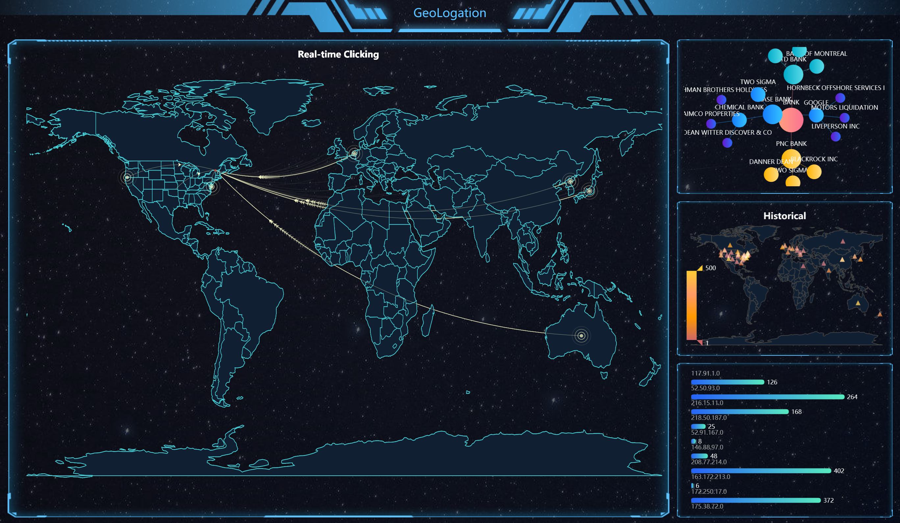
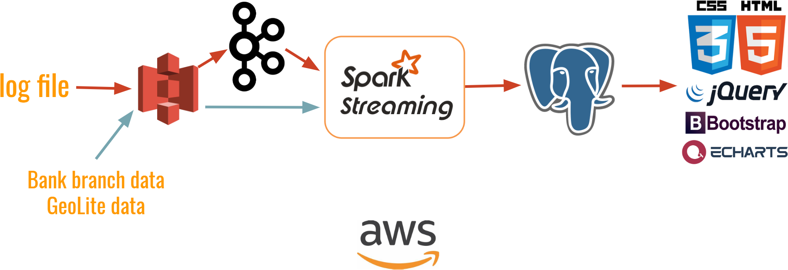

# Geologation
> ***Real-time dashboard for log analysis***

NY-20A Insight data engineering project.
Website link: [dataengineer.cc](http://dataengineer.cc/)

***

## Introduction

1.*Real-time module* 
 - locations and numbers of clicking activities happening all over the world (main map);
 - high frequncy ip clicking activities and their frequencies (bottom right).

2.*Historical module* 
 - Heatmap of clicking activities across one week (middle right); 
 - company relational graph parsed out of clicking (upper right). 


> *header and box style reference: Apache Echarts Plaftorm Template*

## Data Sources
  1. Streaming: [EDGAR log](https://www.sec.gov/dera/data/edgar-log-file-data-set.html) treated as if it were real-time.
  2. Static: [GeoLite](https://lite.ip2location.com/ip2location-lite), [SEC-CIK-lookup](https://www.sec.gov/Archives/edgar/cik-lookup-data.txt)

## Pipeline

This project replay EDGAR log file in real-time manner. Log messages are produced by Kafka and consumed by Spark Streaming. Static data is directly loaded into Spark Streaming, joining with streaming data. Streaming engine is structured streaming.


## File Structure
```
.
├── README.md
├── app
│   ├── server.py
|   ├── static
|   |   ├── css
|   |   |   └── app.css
|   |   ├── js
|   |   |   ├── map-usa.js
|   |   |   └── map-world.js
|   |   └── img
|   |       ├── bg01.png
|   |       ├── header.png
|   |       └── panel.png
|   |
│   └── templates
│       └── index.html
├── images
│   ├── pipeline.png
│   └── webapp.png
|
├── kafka
│   ├── kproducer.sh
│   └── kproducer.py
|
├── stream
│   └── stream.py
|
├── data
|   ├── fetchdata.py
|   ├── iplist
|   └── sample.txt
|
├── requirements.txt
└── sql_schema.txt
```

## Setup
Install and configure [AWS CLI](https://aws.amazon.com/cli/) and [Pegasus](https://github.com/InsightDataScience/pegasus) on your local machine. Setup 4 `m4.large` EC2 instance and install awscli.

- (3 nodes) Kafka cluster
- (3 nodes) Stream
- (1 node) Flask

```bash
$ pip install awscli
```
Add the following credentials as environment variables to your `~/.bash_profile`.

```bash
# AWS Credentials
export AWS_BUCKET_NAME=XXXX
export AWS_ACCESS_KEY_ID=XXXX
export AWS_SECRET_ACCESS_KEY=XXXX

# PostgreSQL configuration
export POSTGRESQL_USER=XXXX
export POSTGRESQL_PASSWORD=XXXX
export POSTGRESQL_HOST_IP=XXXX
export POSTGRESQL_PORT=XXXX
export POSTGRESQL_DATABASE=XXXX

# Upgrade Spark default python version to 3.7
export PYSPARK_PYTHON=XXXX
export PYSPARK_DRIVER_PYTHON=XXXX
```

## Running Geologation
### Start streaming job
### Start streaming with Kafka
### Flask
